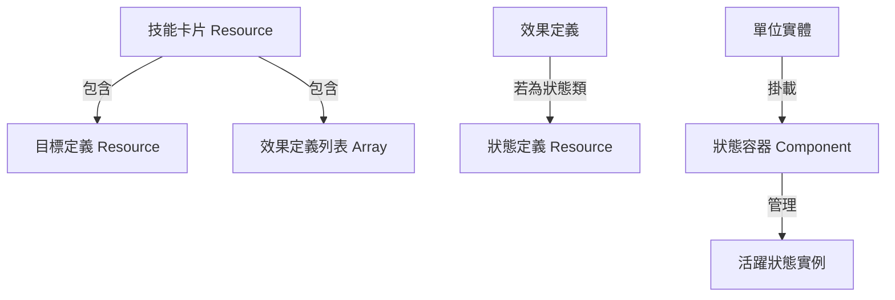

# 模組化技能卡片系統設計規劃

## 1. 核心資源系統 (Soul System)

首先確立資源循環，這將由 `PlayerResourceLedger` 或 `TurnManager` 管理。

*   **機制**：
    *   **SOUL (靈魂)**：施放技能的消耗資源。
    *   **回復**：每回合開始時回復 **3** 點。
    *   **上限**：最大累積 **10** 點。
    *   **抽牌**：每回合開始時抽 **1** 張卡片。

## 2. 系統架構圖

## 3. 資料結構定義 (Resources)

所有的變種 (衍生) 都將是不同的 `.tres` 檔案，但共用相同的腳本邏輯。

### A. 技能卡片定義 (`SkillCard.gd`)
繼承自 `BaseCard`。

*   **`cost`**: `int` (消耗 SOUL)
*   **`card_name`**: `String`
*   **`description`**: `String` (支援動態數值顯示)
*   **`targeting`**: `TargetingDefinition` (定義如何選擇目標)
*   **`effects`**: `Array[EffectDefinition]` (定義選中目標後發生什麼事，支援多重效果)

### B. 目標選擇定義 (`TargetingDefinition.gd`)
定義卡片可以被拖曳到哪裡，以及實際影響哪些單位。

*   **`scope_type`**: `Enum`
    *   `SINGLE` (單體)
    *   `AREA_CIRCLE` (圓形/菱形範圍)
    *   `AREA_SQUARE` (矩形範圍)
    *   `AREA_CROSS` (十字範圍)
    *   `GLOBAL` (全圖)
*   **`aoe_radius`**: `int` (若是範圍技，半徑多少)
*   **`target_filter`**: `Enum`
    *   `ALLY` (僅我方)
    *   `ENEMY` (僅敵方)
    *   `ALL` (無差別)
    *   `SELF` (僅限自己 - 如果是指揮官模式可能不適用，除非指定單位發動)
*   **`can_target_empty`**: `bool` (是否可以對空地施放，例如召喚圖騰或陷阱)

### C. 效果定義 (`EffectDefinition.gd`)
定義具體的數值運算邏輯。

*   **`effect_type`**: `Enum`
    *   `HEAL` (回復)
    *   `DAMAGE` (傷害)
    *   `ADD_STATUS` (施加狀態)
    *   `REMOVE_STATUS` (移除狀態 - 淨化/驅散)
    *   `MODIFY_RESOURCE` (回費/扣費)
*   **`value_calculation`**: `Enum` (數值來源)
    *   `FIXED` (固定數值)
    *   `PERCENT_TARGET_ATK` (目標攻擊力的 %)
    *   `PERCENT_TARGET_HP` (目標最大血量的 %)
    *   `PERCENT_TARGET_LOST_HP` (目標已損血量的 %)
*   **`base_value`**: `float` (基礎數值，例如 2.0 代表 200%)
*   **`status_to_apply`**: `StatusDefinition` (若類型為 `ADD_STATUS` 時填入)

### D. 狀態定義 (`StatusDefinition.gd`)
定義 Buff / Debuff 的規則。

*   **`id`**: `String` (唯一標識，如 "weakness")
*   **`display_name`**: `String`
*   **`icon`**: `Texture2D`
*   **`behavior_type`**: `Enum`
    *   `STAT_MODIFIER` (屬性修正：攻/防/易傷/減傷)
    *   `RESTRICTION` (行為限制：癱瘓/沉默)
    *   `OVER_TIME` (DOT/HOT：燃燒/中毒/再生)
    *   `TRIGGER` (觸發型：尖刺/反擊)
    *   `SHIELD` (護盾)
*   **`stacking_rule`**: `Enum`
    *   `OVERRIDE` (覆蓋：新的取代舊的，刷新時間) -> 用於回復、癱瘓、虛弱
    *   `INDEPENDENT` (獨立：多層並存，各自計時) -> 用於燃燒
    *   `STACK_VALUE` (堆疊數值：時間取最大或刷新，數值相加) -> 用於護盾(可選)
*   **`duration_turns`**: `int` (持續回合)
*   **`params`**: `Dictionary` (彈性參數)
    *   例：`{"stat": "attack", "percent": -0.5}` (減少 50% 攻擊)
    *   例：`{"damage_percent": 1.0}` (燃燒傷害倍率)

## 4. 狀態效果實作邏輯 (Status Implementation)

單位身上將掛載一個 `StatusManager` 節點，負責處理回合流轉與數值計算。

### 各類型狀態實作詳情：

1.  **[回復] (HOT - Heal Over Time)**
    *   `behavior_type`: `OVER_TIME`
    *   `stacking_rule`: `OVERRIDE`
    *   邏輯：回合開始時，根據快照的數值或當前數值回復 HP。
2.  **[癱瘓] (Restriction)**
    *   `behavior_type`: `RESTRICTION`
    *   `stacking_rule`: `OVERRIDE`
    *   邏輯：`UnitMovementController` 和 `AttackManager` 在執行前會檢查 `StatusManager.has_restriction("cant_move")`。
3.  **[護盾] (Shield)**
    *   `behavior_type`: `SHIELD`
    *   `stacking_rule`: `STACK_VALUE` (或 `INDEPENDENT`，視需求)
    *   邏輯：在 `take_damage` 函數中，優先扣除護盾值。
4.  **[攻擊力強化/弱化] (Stat Modifier)**
    *   `behavior_type`: `STAT_MODIFIER`
    *   `stacking_rule`: `OVERRIDE`
    *   邏輯：`get_effective_attack()` 會遍歷所有 `STAT_MODIFIER` 類型的狀態進行加成運算。
5.  **[減傷/易傷] (Damage Modifier)**
    *   `behavior_type`: `STAT_MODIFIER`
    *   `stacking_rule`: `OVERRIDE`
    *   邏輯：在 `take_damage` 計算最終傷害時，套用 `damage_received_multiplier`。
6.  **[燃燒] (DOT - Independent Stacks)**
    *   `behavior_type`: `OVER_TIME`
    *   `stacking_rule`: `INDEPENDENT`
    *   邏輯：`StatusManager` 內會有一個 Array 存儲多個燃燒實例。每回合結束時，遍歷 Array，每個實例單獨造成傷害並減少回合數。
7.  **[尖刺] (Trigger - Thorns)**
    *   `behavior_type`: `TRIGGER`
    *   邏輯：監聽 `take_damage` 事件，若攻擊來源是鄰近單位，則對來源造成等同於當前護盾值(或特定數值)的傷害。

## 5. 實例配置演示 (JSON 風格)

### 案例 1：包紮 - 衍生 [規劃]
*描述：指定一名成員 十字無限範圍 "200%攻擊力"[回復] COST 3*

**SkillCard Resource:**
*   `cost`: 3
*   `targeting`:
    *   `scope_type`: `AREA_CROSS`
    *   `target_filter`: `ALLY`
*   `effects`: [
    *   `EffectDefinition`:
        *   `effect_type`: `HEAL`
        *   `value_calculation`: `PERCENT_TARGET_ATK`
        *   `base_value`: 2.0 (200%)
]

### 案例 2：包紮 - 衍生 [節能]
*描述：指定一名成員 "500%攻擊力"[回復] 添加兩回合的[癱瘓] COST 2*

**SkillCard Resource:**
*   `cost`: 2
*   `targeting`: `SINGLE`, `ALLY`
*   `effects`: [
    *   `EffectDefinition (Heal)`:
        *   `effect_type`: `HEAL`
        *   `value_calculation`: `PERCENT_TARGET_ATK`
        *   `base_value`: 5.0
    ,
    *   `EffectDefinition (Debuff)`:
        *   `effect_type`: `ADD_STATUS`
        *   `status_to_apply`: `Status_Paralysis.tres`
]

**Status_Paralysis.tres:**
*   `id`: "paralysis"
*   `behavior_type`: `RESTRICTION`
*   `stacking_rule`: `OVERRIDE`
*   `duration_turns`: 2
*   `params`: `{"cant_move": true, "cant_attack": true}`

### 案例 3：詛咒 - 衍生 [破碎]
*描述：指定一個2X2的方形區域 所有範圍內雙方單位添加兩回合的"150%"[易傷] COST 1*

**SkillCard Resource:**
*   `cost`: 1
*   `targeting`:
    *   `scope_type`: `AREA_SQUARE`
    *   `aoe_radius`: 2 (或定義為 2x2 shape)
    *   `target_filter`: `ALL` (雙方單位)
*   `effects`: [
    *   `EffectDefinition`:
        *   `effect_type`: `ADD_STATUS`
        *   `status_to_apply`: `Status_Vulnerability_150.tres`
]

**Status_Vulnerability_150.tres:**
*   `id`: "vulnerability"
*   `behavior_type`: `STAT_MODIFIER`
*   `stacking_rule`: `OVERRIDE`
*   `duration_turns`: 2
*   `params`: `{"stat": "damage_taken_mult", "value": 1.5}`

### 案例 4：燃燒 (獨立堆疊)

**Status_Burn.tres:**
*   `id`: "burn"
*   `behavior_type`: `OVER_TIME`
*   `stacking_rule`: `INDEPENDENT`
*   `duration_turns`: 3
*   `params`: `{"damage_calc": "applier_atk", "multiplier": 0.5}` (假設由施法者攻擊力決定)

## 6. 實作步驟建議

1.  **建立 Status 系統基礎**：
    *   創建 `StatusDefinition` 腳本。
    *   修改 `CharacterData` (或新增 `StatusManager` Component) 以支援狀態列表的增刪查改、堆疊邏輯處理。
    *   實作屬性計算修改 (`get_effective_attack` 等) 以讀取 Status 影響。
2.  **建立卡片效果與目標系統**：
    *   創建 `TargetingDefinition` 和 `EffectDefinition` 腳本。
    *   創建 `SkillCard` 腳本。
3.  **實作 UI 與輸入層**：
    *   修改 `GridInputLayer`，當拖曳的是 `SkillCard` 時，啟用目標選擇器 (顯示 AOE 範圍)。
    *   實作施放邏輯：扣除 Soul -> 實例化效果 -> 應用到目標。
4.  **整合 Soul 資源**：
    *   在 UI 顯示 Soul。
    *   在 `TurnManager` 處理每回合 Soul 回復。

